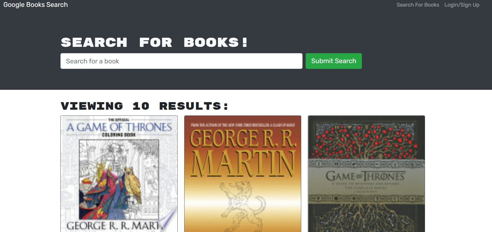

  
  # <h1 align="center"> 🌻 Search Book Engine 🌻 <h1>
  
----

## Table of Contents
- [Description](#description)
- [Installation](#installation)
- [Issues](#issue)
- [Contribution](#contribution)
- [Test Instructions](#test-instructions)
- [Questions](#questions)

----

### Description
This project takes a fully functioning Google Books API search engine guilt with a Restful API and refactored it to be a GraphQL API built with the Apollo Server. This application was built using the MERN stack wuth a React frontend, MongoDB database, and Node.js/Express.js sever and API. This application is deployed on Heroku. [Click Here.](https://fierce-scrubland-74490.herokuapp.com/)
[Or Here.](https://kurdiamina3.github.io/search-book/)

----
### Installation
🔧Node.js, Express.js, MongoDB, Apollo Sever, GraphQL, React

----
### Issues While Developing
✏️Issues ran into was refactoring the package.json files for each directory. Confusing the directories when starting the application was also something I ran into. Ran into some middleware issues. It also currently only wants to work on my localhost and not heroku.

----
### License
✅
This application is covered by the GNU AGPLv3,Apache License 2.0 license.
----

### Contributing
🤝Amina Kurdi

----
### Test-Instructions
N/A

----
### Questions
💻Find me on GitHub: [Github Profile](https://github.com/Kurdiamina3)
 
📧Email me with any questions: Kurdiamina3@gmail.com 
 

🌟_This README was generated with 💓 by [README-generator] (https://github.com/kurdiamina3/README-generator)🌟

